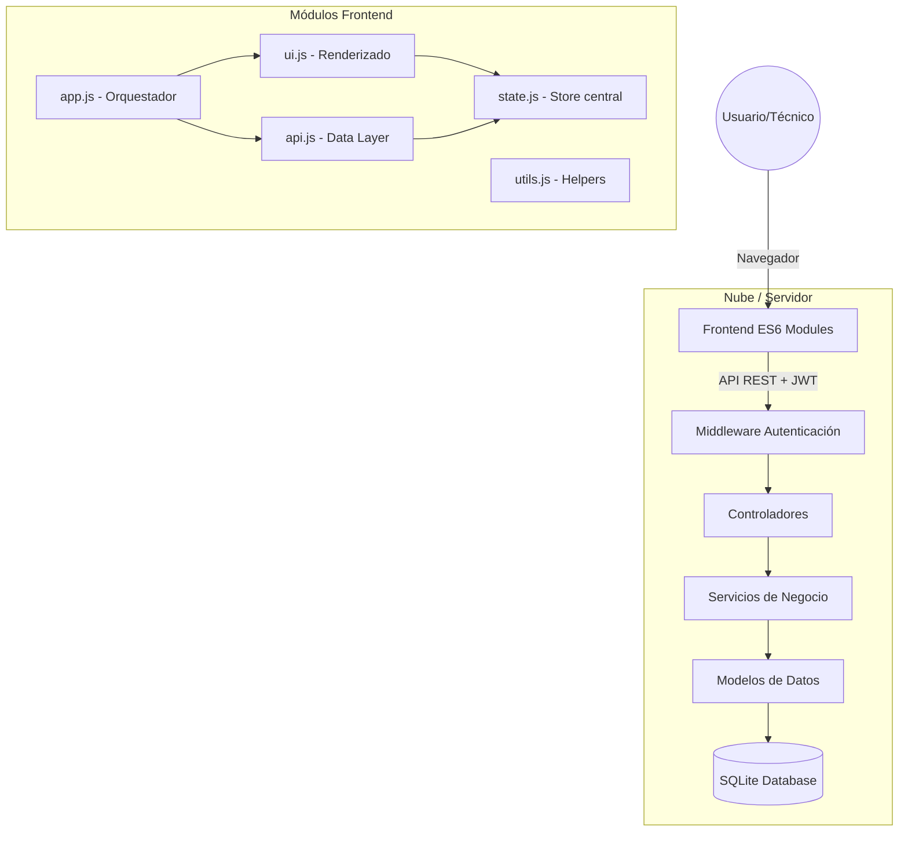

# Sistema de Inventario Informático

[](https://nodejs.org/)
[](https://www.sqlite.org/)
[](https://expressjs.com/)
[](https://jwt.io/)
[](https://developer.mozilla.org/en-US/docs/Web/JavaScript/Guide/Modules)

Un sistema profesional, moderno y seguro para la gestión integral de activos informáticos, diseñado para técnicos y administradores de TI.

---

## Características Principales

- **Autenticación Robusta**: Sistema de seguridad basado en JWT (JSON Web Tokens) con protección de rutas.
- **Arquitectura Modular**: Código frontend desacoplado usando ES Modules y backend organizado en Controladores/Servicios.
- **Dashboard Estadístico**: Visualización en tiempo real del estado del inventario y distribución de equipos.
- **Gestión CRUD Completa**: Control total sobre Equipos, Marcas, Categorías y Ubicaciones.
- **Trazabilidad Total**: Historial detallado de movimientos físicos y bajas (salidas) de inventario.
- **UX Premium**: Interfaz fluida con estados de carga (overlays), notificaciones animadas y diseño responsivo.

---

## Stack Tecnológico

### Backend
- **Core**: [Node.js](https://nodejs.org/) con [Express](https://expressjs.com/)
- **Base de Datos**: [SQLite 3](https://www.sqlite.org/) (Ligero y portátil)
- **Seguridad**: `bcryptjs` para hashing y `jsonwebtoken` para sesiones.

### Frontend
- **Arquitectura**: Vanilla JavaScript con **ES6 Modules**.
- **Diseño**: CSS3 moderno con sistema de grillas (Grid) y Flexbox.
- **Iconografía**: [FontAwesome 6](https://fontawesome.com/).

---

## Arquitectura del Sistema



---

## Instalación y Uso

### Requisitos Previos
- Node.js v18 o superior instalado.

### Instalación
1. Clonar el repositorio:
   ```bash
   git clone https://github.com/NomadCoderCL/sistema-inventario-informatico.git
   ```
2. Instalar dependencias:
   ```bash
   npm install
   ```
3. Inicializar la base de datos:
   ```bash
   npm run init-db
   ```
4. Configurar variables de entorno (Opcional):
   Crear un archivo `.env` basado en `.env.example`.

### Ejecución
Para iniciar el servidor de desarrollo:
```bash
npm start
```
El sistema estará disponible en `http://localhost:3000`.

**Credenciales por defecto:**
- **Usuario**: `admin`
- **Contraseña**: `Admin123!`

---

## Seguridad
- Todas las contraseñas se almacenan mediante **hashing con Salt** (bcrypt).
- La API está protegida y requiere un **Bearer Token** legítimo.
- Se implementa protección básica contra inyecciones SQL mediante el uso de parámetros en las queries.

## Gestión de Datos
- **Backups**: El sistema genera un respaldo automático del archivo `.db` en el directorio raíz antes de realizar inicializaciones críticas.
- **Documentación de DB**: Puedes encontrar el esquema detallado en [DATABASE.md](./database/DATABASE.md).

---

## Capturas de Pantalla
*(Próximamente: Agregue capturas de pantalla de su dashboard y listado de equipos aquí)*

---

## Autor
**NomadCoderCL**
- LinkedIn: [Su Perfil]
- Portfolio: [URL de su portfolio]
