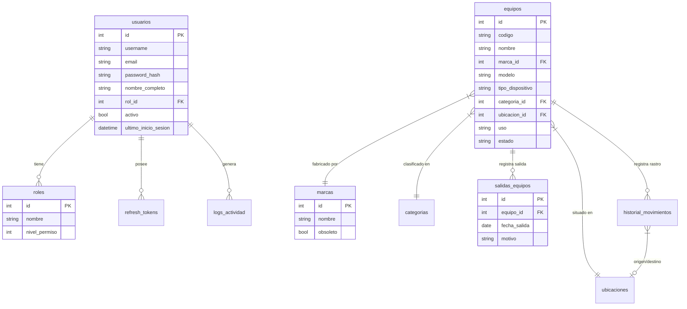

# Estructura de la Base de Datos

El sistema utiliza **SQLite 3** para el almacenamiento de datos. A continuación se detalla el esquema de tablas y sus relaciones.

## Diagrama de Entidad-Relación (ERD)

## Descripción de Tablas Principales

### 1. `equipos`
Almacena el inventario principal de hardware.
- `codigo`: Identificador único (ej: PC001).
- `uso`: Enum ('nuevo', 'usado').
- `estado`: Enum ('buen estado', 'malas condiciones', 'mantenimiento', 'retirado').

### 2. `usuarios` y `roles`
Gestión de acceso y permisos.
- **Roles predefinidos**:
    - `Super Administrador` (100): Acceso total.
    - `Administrador` (80): Gestión general.
    - `Técnico` (50): Operaciones de hardware.
    - `Usuario` (10): Consulta básica.

### 3. `historial_movimientos`
Bitácora de todos los traslados físicos de los equipos entre ubicaciones.

### 4. `salidas_equipos`
Registro definitivo de equipos que abandonan el inventario (bajas, ventas, donaciones).

### 5. `logs_actividad`
Auditoría técnica de cambios en la base de datos (quién cambió qué y cuándo).

---

## Mantenimiento
Los backups se generan automáticamente con el formato `inventario-backup-YYYYMMDD_HHMMSS.db` antes de realizar operaciones críticas de estructura.
